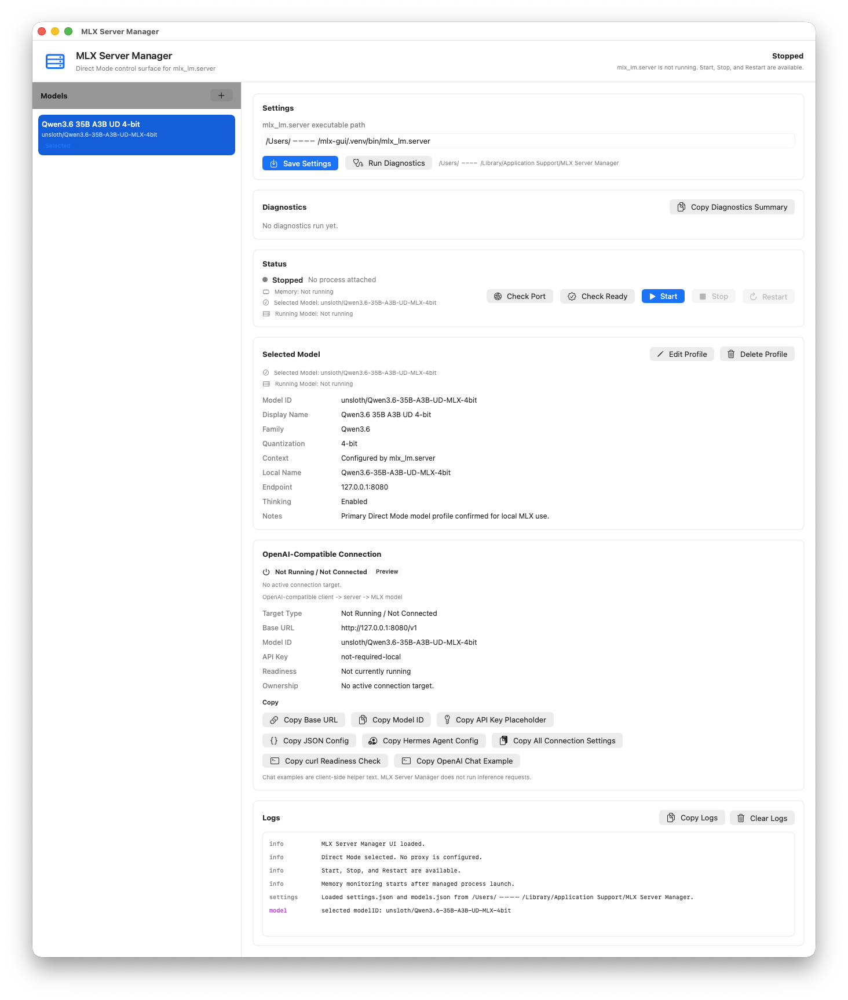
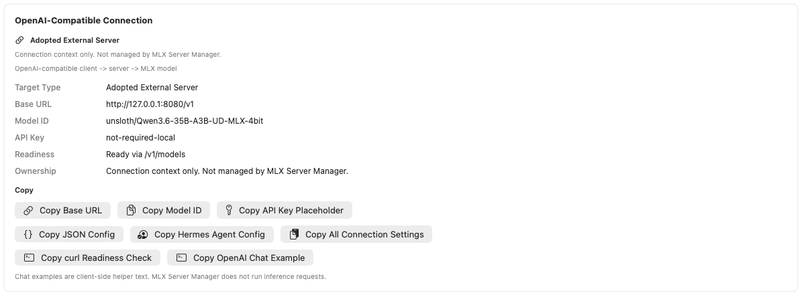
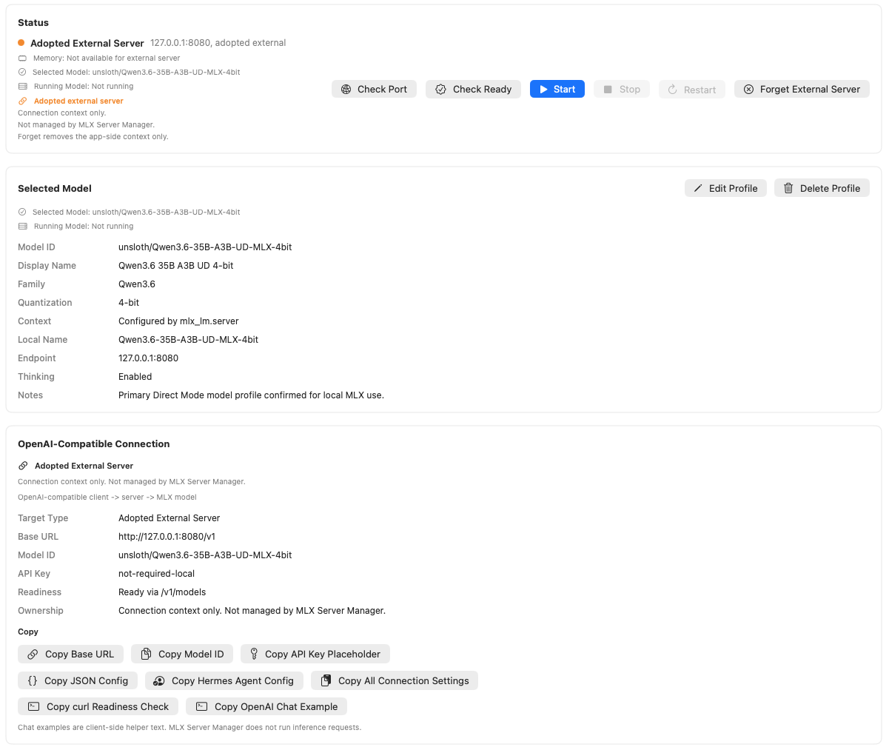
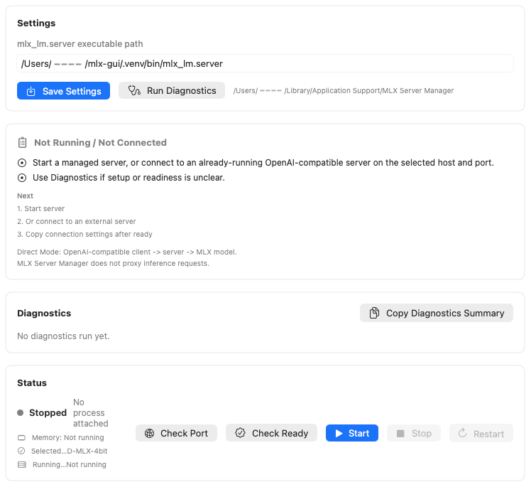

# MLX Server Manager

MLX Server Manager is a lightweight macOS SwiftUI GUI for operating local OpenAI-compatible MLX endpoints in Direct Mode.

It is primarily a control surface for app-managed `mlx_lm.server`, with support for detecting and adopting an already-running external OpenAI-compatible server as connection context.

The app keeps Direct Mode:

```text
OpenAI-compatible client -> mlx_lm.server or adopted external server -> MLX model
```

MLX Server Manager controls and observes app-managed local server processes, but it does not enter the inference request path. OpenAI-compatible clients connect directly to the server endpoint.

## Screenshots

### Main Dashboard



The main dashboard shows the core MLX Server Manager workflow in one place: model profiles, app settings, diagnostics, server status, selected model details, OpenAI-compatible connection settings, and logs.

MLX Server Manager remains a Direct Mode control surface for `mlx_lm.server`. It does not proxy inference requests.

### Connection Settings / Current Target



Connection Settings shows the current OpenAI-compatible target clearly.

It displays:

- target type
- Base URL
- Model ID
- API key placeholder
- readiness endpoint
- ownership note
- copy actions for client setup

The copy actions help configure OpenAI-compatible clients, including Hermes Agent, without routing inference through MLX Server Manager.

### Adopted External Server



Adopted External Server mode lets users use a detected external OpenAI-compatible server as a connection context.

Adopt does not mean process ownership. MLX Server Manager does not stop, restart, kill, monitor memory for, or collect logs from adopted external servers.

The Direct Mode path remains:

`OpenAI-compatible client -> mlx_lm.server or adopted external server -> MLX model`

### First-run Onboarding Guidance



The onboarding guidance panel gives short, state-aware setup hints for first-time users.

It helps users understand what to configure next, such as the `mlx_lm.server` executable path, selected model profile, server state, and connection settings.

The guidance is informational only. It does not install dependencies, download models, start external processes, proxy inference, or change process ownership.

## Why This Project Exists

`mlx_lm.server` is fast and simple, but day-to-day local use benefits from a small GUI around process management, diagnostics, model profiles, logs, memory display, external endpoint visibility, and connection settings.

MLX Server Manager exists to provide that management layer without becoming the inference layer. The goal is to make pure `mlx_lm.server` easier to operate for local OpenAI-compatible clients, especially agent tools that need a stable local endpoint.

## Project Principles

MLX Server Manager follows three product principles:

1. Preserve `mlx-lm` runtime performance as the top priority.
2. Make `mlx-lm` usable for users who are not comfortable with CLI workflows.
3. Adopt useful features from other local LLM tools when they do not conflict with `mlx-lm` performance, safety, or Direct Mode boundaries.

See [docs/product_direction.md](docs/product_direction.md) for the full project direction, including current non-goals and future candidate features.

## What This Is

- A local macOS app for starting, stopping, and restarting an app-managed `mlx_lm.server`.
- A status and diagnostics surface for readiness checks via `GET /v1/models`.
- A model profile editor for local OpenAI-compatible endpoint settings.
- A managed-process log and memory display.
- A Direct Mode connection settings copier for OpenAI-compatible clients.
- A conservative external server detector for selected host/port endpoints.
- An Adopt External Server flow for connection context only, not process ownership.

## What This Is Not

- Not a chat UI.
- Not an inference proxy.
- Does not currently include model download or install automation.
- Not a model deletion tool.
- Not a multi-backend wrapper.
- Not a replacement for `mlx-lm` or model setup.

## Quick Start

1. Download `MLXServerManager-v1.9.0-unsigned.zip` from the GitHub Release.
2. Extract the zip and confirm it contains `MLXServerManager.app`.
3. Open the app.
   - This is an unsigned, non-notarized local-use build.
   - macOS may show a Gatekeeper warning such as "`MLXServerManager` is damaged and can't be opened".
   - If you trust the Release asset, verify the zip contents and checksum before removing quarantine:

     ```sh
     xattr -dr com.apple.quarantine /path/to/MLXServerManager.app
     open -n /path/to/MLXServerManager.app
     ```

4. In Settings, set the `mlx_lm.server executable path`.
5. Configure or add a Model Profile.
6. Run Setup Diagnostics.
7. Press Start.
8. Confirm the Current Target summary in Connection Settings.
9. Copy Base URL, Model ID, API key placeholder, JSON config, Hermes Agent config, or curl readiness check from Connection Settings.
10. Paste those values into an OpenAI-compatible client.

You must provide your own `mlx-lm` environment, `mlx_lm.server` executable, and model files or Hugging Face cache. The app keeps Direct Mode: the client connects directly to `mlx_lm.server`; MLX Server Manager does not proxy inference traffic or run chat completions.

See [docs/distribution.md](docs/distribution.md) for release asset and Gatekeeper details, and [docs/known_limitations.md](docs/known_limitations.md) for the full stable-scope boundary.

See [docs/benchmark_findings.md](docs/benchmark_findings.md) for benchmark-informed notes on Direct Mode, long-context workloads, streaming TTFT, and future optional Advanced Launch Options.

Advanced Launch Options are optional, per-profile user-tunable settings. They are empty by default and omitted from launch arguments unless explicitly set. See [docs/advanced_launch_options.md](docs/advanced_launch_options.md) for design notes and safety boundaries.

External server detection is documented in [docs/external_server_detection.md](docs/external_server_detection.md). It detects existing OpenAI-compatible servers on the selected host/port without taking ownership of external processes.

Adopt External Server behavior is documented in [docs/adopt_external_server.md](docs/adopt_external_server.md). v1.7.0 adds the initial implementation for explicitly adopting a detected external server as connection context only, without taking process ownership.

Connection Settings polish is documented in [docs/connection_settings_polish.md](docs/connection_settings_polish.md). v1.9.0 implements the initial Current Target summary and expanded copy actions for Managed, External Detected, Adopted, and Not Running connection states. Direct Mode remains unchanged.

Dashboard UI Refresh planning is documented in [docs/dashboard_ui_refresh.md](docs/dashboard_ui_refresh.md). v4.1.0 is a docs-only design step for a future dashboard refresh. v4.2.0 adds the first small app-code foundation with dashboard cards for Current Target and Server State. v4.3.0 polishes Current Target wording. v4.4.0 polishes Server State wording. v4.5.0 adds display-only Logs / Diagnostics guidance for readiness failures, port busy states, unavailable targets, managed logs, and external connection context while preserving lifecycle behavior, Direct Mode, external server ownership boundaries, and Import / Export behavior.

Screenshot refresh planning is documented in [docs/screenshot_refresh.md](docs/screenshot_refresh.md). Future screenshots should cover the v1.9+ Current Target summary and Adopted External Server states without exposing private paths or secrets.

First-run guidance is documented in [docs/onboarding_first_run.md](docs/onboarding_first_run.md). v2.4.0 adds a small in-app guidance panel that points first-time users toward executable path setup, model profile selection, diagnostics, Start, and Connection Settings while preserving Direct Mode.

Model Profile export and import are documented in [docs/model_profile_import_export.md](docs/model_profile_import_export.md). v4.0.0 treats Import / Export as a stable metadata-only feature set: Export Profiles, Import Preview, Import Selected Profiles, Rename for profile-name conflicts, explicit Replace for one unambiguous existing profile target, and deterministic regression tests. Import does not include model weights, caches, API keys, tokens, executable paths, or automatic server start.

## Current Binary Asset

The current downloadable app binary asset is the latest app-code release:

- `MLXServerManager-v4.4.0-unsigned.zip`

v4.0.0 and v4.1.0 are docs-only preparation releases. v4.2.0, v4.3.0, and v4.4.0 are app-code dashboard polish releases with unsigned app zip assets. v4.5.0 also changes app UI code, so it will need a new unsigned app zip when released.

## Target Users

- macOS users running local MLX / `mlx-lm`.
- Users who want a GUI for `mlx_lm.server` Start, Stop, Restart, diagnostics, logs, model profiles, and connection settings.
- Users of OpenAI-compatible clients such as Hermes Agent, Open WebUI, LibreChat, AnythingLLM, or custom scripts.

## Supported Client Context

MLX Server Manager presents connection information for OpenAI-compatible clients. Typical clients use:

- Base URL: `http://127.0.0.1:8080/v1`
- Model ID: the selected Model Profile's `modelID`
- API key placeholder: `not-required-local`

The client sends inference requests directly to the selected server endpoint. MLX Server Manager starts, stops, monitors, diagnoses, and copies connection settings for app-managed `mlx_lm.server`; for adopted external servers it provides connection context only.

For Hermes Agent and similar clients, see [docs/hermes_agent_connection.md](docs/hermes_agent_connection.md). Hermes Agent is treated as an OpenAI-compatible client; MLX Server Manager still stays outside the inference request path.

## Current Feature Set

As of v4.5.0, MLX Server Manager includes:

- Start, Stop, and Restart for the `mlx_lm.server` process started by this app.
- Managed-process-only Stop and Restart behavior.
- Port availability check.
- Ready check via `GET /v1/models`.
- Settings save and restore.
- Model profile add, edit, delete, and selection.
- Export Profiles for model profile metadata backup.
- Import selected valid model profiles from JSON metadata.
- Import Preview validation for schema v1 profile export documents.
- Rename for imported profile-name conflicts.
- Explicit Replace for one unambiguous existing profile target.
- Import / Export fixtures and XCTest regression coverage.
- Model switching with `Restart required` state.
- Advanced Launch Options per model profile.
- External Server Detection for selected host/port endpoints.
- Adopt External Server and Forget External Server for connection context only.
- Current Target summary in Connection Settings:
  - Managed Server
  - External Server Detected
  - Adopted External Server
  - Not Running / Not Connected
- Dashboard foundation cards for Current Target and Server State.
- Polished Current Target wording for no target, managed server, external server, adopted external server, unavailable endpoint, and readiness states.
- Polished Server State wording for managed process ownership, external context, readiness, lifecycle, stopped, unavailable, and failed states.
- Display-only Dashboard guidance for logs, diagnostics, readiness failures, port busy states, unavailable targets, and external server log boundaries.
- Lightweight Onboarding Guidance panel for first-run setup and connection state hints.
- Menu bar quick actions.
- Logs readability improvements.
- Copy Logs.
- Setup Diagnostics summary.
- Copy Diagnostics Summary.
- OpenAI-compatible connection setting copy actions:
  - Copy Base URL
  - Copy Model ID
  - Copy API key placeholder
  - Copy JSON config
  - Copy Hermes Agent config
  - Copy all connection settings
  - Copy `curl /v1/models` readiness check
  - Copy OpenAI-compatible chat example text
- Unsigned `.app` zip distribution documentation.

The copied `curl /v1/chat/completions` text is only a client-side convenience example. The app itself uses `/v1/models` for readiness and diagnostics and does not send inference requests.

## Non-Goals

- Chat UI.
- Proxy mode.
- LAN Web UI.
- App Intents.
- Auto unload.
- Hugging Face download manager.
- Model download in the current release.
- Model deletion.
- Hugging Face cache deletion.
- Multiple concurrent server management.
- Multiple model simultaneous launch.
- RAG.
- Embedding manager.
- Tool-call translation.
- Telemetry, analytics, crash reporting, external log sending, or cloud logging.
- Persistent file logging.
- Notarization, Developer ID signing, DMG, App Store distribution, Homebrew cask, auto updater, or CI/CD release automation.

Model download is a future candidate only if it can preserve `mlx-lm` runtime performance, avoid silent downloads or automatic server start, and keep clear safety and privacy boundaries.

## First-Run Workflow

1. Prepare a working local `mlx-lm` environment yourself.
2. Launch MLX Server Manager.
3. Open Settings and set the `mlx_lm.server executable path`.
4. Configure a Model Profile:
   - Display name
   - Model ID
   - Host
   - Port
   - Enable thinking option
   - Notes
5. Run Setup Diagnostics.
6. Start the managed server.
7. Confirm Ready status via `/v1/models`.
8. Copy Base URL, Model ID, JSON config, or curl examples from Connection Settings.
9. Paste those values into your OpenAI-compatible client.
10. Use Stop or Restart when needed.

For local use, `127.0.0.1` is recommended:

- Host: `127.0.0.1`
- Port: `8080`
- Base URL: `http://127.0.0.1:8080/v1`
- API key placeholder: `not-required-local`

Do not expose `mlx_lm.server` directly to the internet.

## OpenAI-Compatible Client Example

JSON config:

```json
{
  "api_key": "not-required-local",
  "base_url": "http://127.0.0.1:8080/v1",
  "model": "unsloth/Qwen3.6-35B-A3B-UD-MLX-4bit"
}
```

List models:

```sh
curl http://127.0.0.1:8080/v1/models
```

Minimal chat-completions request for an external client:

```sh
curl http://127.0.0.1:8080/v1/chat/completions \
  -H "Content-Type: application/json" \
  -H "Authorization: Bearer not-required-local" \
  -d '{
    "model": "unsloth/Qwen3.6-35B-A3B-UD-MLX-4bit",
    "messages": [
      {"role": "user", "content": "こんにちは"}
    ],
    "max_tokens": 128,
    "chat_template_kwargs": {
      "enable_thinking": false
    }
  }'
```

Qwen thinking behavior is controlled by the client request and model template behavior. MLX Server Manager only copies helper text; it does not run this request.

## Known Limitations

- The documented release asset is an unsigned local-use `.app` zip.
- The app is not notarized and is not signed with Developer ID.
- macOS Gatekeeper may warn when opening the app.
- Browser-downloaded unsigned builds may show "`MLXServerManager` is damaged and can't be opened"; this can be Gatekeeper quarantine, not necessarily a broken zip or app. Verify the Release asset and checksum before removing quarantine.
- The app does not bundle `mlx-lm`.
- The app does not bundle models.
- You must provide model files or Hugging Face cache separately.
- The app does not download models.
- The app does not optimize inference.
- The app does not alter the MLX performance path.
- Ready Check uses `/v1/models` only.
- The app does not test chat completions.
- Stop and Restart affect only the process started and held by this app.
- External `mlx_lm.server` processes are not stopped.
- There is no automatic updater, DMG, installer, or CI/CD release pipeline.

See [docs/known_limitations.md](docs/known_limitations.md) for the full list.

If macOS blocks the unsigned app after download, see [docs/distribution.md](docs/distribution.md#gatekeeper-quarantine-warning) before running it.

## Configuration and Repository Hygiene

The app stores runtime configuration under the user's Application Support directory:

- `settings.json`
- `models.json`

These files are local runtime state and should not be committed. Model directories, model artifacts, logs, virtual environments, `.env`, `HF_TOKEN`, `.app`, `.zip`, `.dSYM`, and build artifacts must also stay out of Git.

Do not hardcode user-specific absolute paths in source code or committed documentation.

## AI-Assisted Maintenance

This project is maintained with human-reviewed AI assistance for planning, documentation, implementation, and release preparation. AI-generated changes should remain small, reviewable, and consistent with the Direct Mode product boundary.

All changes should be reviewed for:

- No secrets.
- No local personal paths.
- No model files or runtime settings.
- No app bundles or build artifacts.
- No expansion into Chat UI, inference proxy behavior, or multi-backend wrapper behavior.

## Documentation

- Contributing: [CONTRIBUTING.md](CONTRIBUTING.md)
- Security: [SECURITY.md](SECURITY.md)
- Issue templates: [.github/ISSUE_TEMPLATE/](.github/ISSUE_TEMPLATE/)
- Public release checklist: [docs/public_release_checklist.md](docs/public_release_checklist.md)
- Stable scope: [docs/stable_scope.md](docs/stable_scope.md)
- Known limitations: [docs/known_limitations.md](docs/known_limitations.md)
- Hermes Agent connection guide: [docs/hermes_agent_connection.md](docs/hermes_agent_connection.md)
- Advanced Launch Options: [docs/advanced_launch_options.md](docs/advanced_launch_options.md)
- External Server Detection: [docs/external_server_detection.md](docs/external_server_detection.md)
- Adopt External Server: [docs/adopt_external_server.md](docs/adopt_external_server.md)
- Connection Settings polish: [docs/connection_settings_polish.md](docs/connection_settings_polish.md)
- Screenshot refresh plan: [docs/screenshot_refresh.md](docs/screenshot_refresh.md)
- Onboarding / first-run guidance: [docs/onboarding_first_run.md](docs/onboarding_first_run.md)
- Model Profile import/export design: [docs/model_profile_import_export.md](docs/model_profile_import_export.md)
- v1.0 plan: [docs/v1.0_plan.md](docs/v1.0_plan.md)
- v1.0.1 maintenance plan: [docs/v1.0.1_maintenance.md](docs/v1.0.1_maintenance.md)
- Requirements: [docs/requirements.md](docs/requirements.md)
- Architecture: [docs/architecture.md](docs/architecture.md)
- Testing: [docs/testing.md](docs/testing.md)
- Distribution: [docs/distribution.md](docs/distribution.md)
- Behavioral contracts: [contracts/](contracts/)
