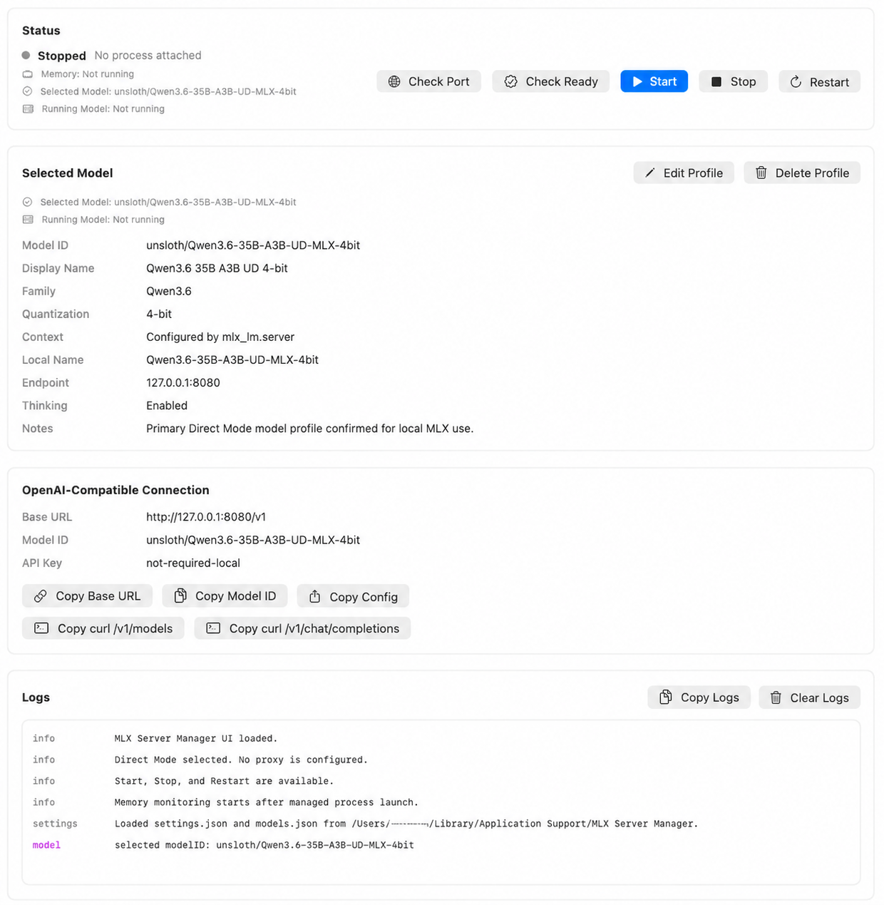
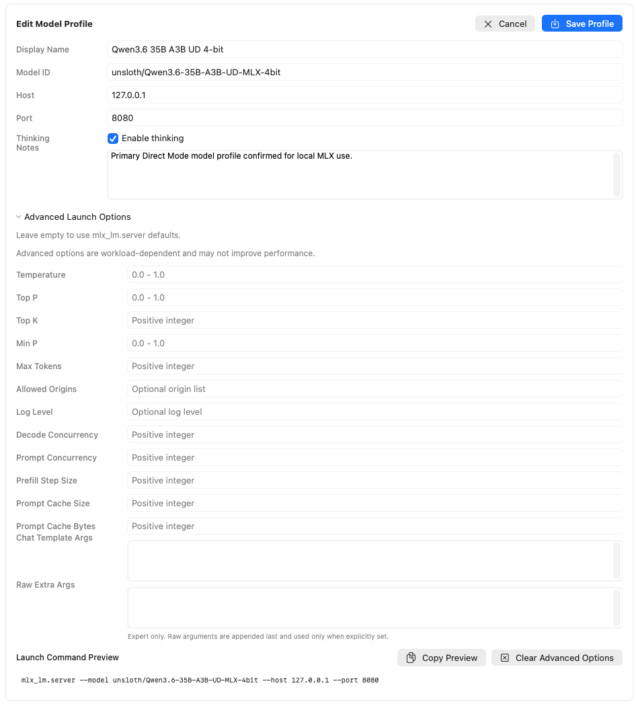

# MLX Server Manager

MLX Server Manager is a lightweight macOS SwiftUI GUI for managing pure `mlx_lm.server` on Apple Silicon in Direct Mode.

It helps Apple Silicon users expose local MLX models as OpenAI-compatible endpoints for local agent tools while keeping the inference path direct.

The app keeps Direct Mode:

```text
OpenAI-compatible client -> mlx_lm.server
```

MLX Server Manager controls and observes the managed local server process, but it does not enter the inference request path. OpenAI-compatible clients connect directly to `mlx_lm.server`.

## Screenshot



MLX Server Manager provides a local Direct Mode control surface for managing `mlx_lm.server`, checking status, viewing logs, and copying OpenAI-compatible connection settings.

### Advanced Launch Options



Advanced Launch Options are optional per-profile settings for users who want to experiment with `mlx_lm.server` launch arguments. Leave fields empty to use `mlx_lm.server` defaults and preserve the simple launch command. The editor includes Copy Preview, Clear Advanced Options, and validation for common numeric and JSON inputs.

These options only affect the managed `mlx_lm.server` launch command. MLX Server Manager remains Direct Mode and does not proxy inference requests.

## Why This Project Exists

`mlx_lm.server` is fast and simple, but day-to-day local use benefits from a small GUI around process management, diagnostics, model profiles, logs, memory display, and connection settings.

MLX Server Manager exists to provide that management layer without becoming the inference layer. The goal is to make pure `mlx_lm.server` easier to operate for local OpenAI-compatible clients, especially agent tools that need a stable local endpoint.

## What This Is Not

- Not a chat UI.
- Not an inference proxy.
- Not a model downloader.
- Not a model deletion tool.
- Not a multi-backend wrapper.
- Not a replacement for `mlx-lm` or model setup.

## Quick Start

1. Download `MLXServerManager-v1.0.0-unsigned.zip` from the GitHub Release.
2. Extract the zip and confirm it contains `MLXServerManager.app`.
3. Open the app.
   - This is an unsigned, non-notarized local-use build.
   - macOS may show a Gatekeeper warning such as "`MLXServerManager` is damaged and can't be opened".
   - If you trust the Release asset, verify the zip contents and checksum before removing quarantine:

     ```sh
     xattr -dr com.apple.quarantine /path/to/MLXServerManager.app
     open -n /path/to/MLXServerManager.app
     ```

4. In Settings, set the `mlx_lm.server executable path`.
5. Configure or add a Model Profile.
6. Run Setup Diagnostics.
7. Press Start.
8. Copy Base URL, Model ID, or JSON config from Connection Settings.
9. Paste those values into an OpenAI-compatible client.

You must provide your own `mlx-lm` environment, `mlx_lm.server` executable, and model files or Hugging Face cache. The app keeps Direct Mode: the client connects directly to `mlx_lm.server`; MLX Server Manager does not proxy inference traffic or run chat completions.

See [docs/distribution.md](docs/distribution.md) for release asset and Gatekeeper details, and [docs/known_limitations.md](docs/known_limitations.md) for the full stable-scope boundary.

See [docs/benchmark_findings.md](docs/benchmark_findings.md) for benchmark-informed notes on Direct Mode, long-context workloads, streaming TTFT, and future optional Advanced Launch Options.

Advanced Launch Options are optional, per-profile user-tunable settings. They are empty by default and omitted from launch arguments unless explicitly set. See [docs/advanced_launch_options.md](docs/advanced_launch_options.md) for design notes and safety boundaries.

External server detection is documented in [docs/external_server_detection.md](docs/external_server_detection.md). It detects existing OpenAI-compatible servers on the selected host/port without taking ownership of external processes.

Adopt External Server behavior is documented in [docs/adopt_external_server.md](docs/adopt_external_server.md). v1.7.0 adds the initial implementation for explicitly adopting a detected external server as connection context only, without taking process ownership.

Future Connection Settings polish is documented in [docs/connection_settings_polish.md](docs/connection_settings_polish.md). It focuses on making Managed, External Detected, and Adopted target configuration easier to understand and copy without changing the Direct Mode inference path.

v1.9.0 implements the initial Current Target summary and expanded copy actions for Managed, External Detected, Adopted, and Not Running connection states. Direct Mode remains unchanged.

## Current Binary Asset

The current app binary asset is still:

- `MLXServerManager-v1.0.0-unsigned.zip`

v1.0.1, v1.0.2, and v1.0.3 are documentation-only releases. They update guidance, release notes, Gatekeeper explanations, first-run flow, and benchmark-informed direction, but they do not change the app binary.

## Target Users

- macOS users running local MLX / `mlx-lm`.
- Users who want a GUI for `mlx_lm.server` Start, Stop, Restart, diagnostics, logs, model profiles, and connection settings.
- Users of OpenAI-compatible clients such as Hermes Agent, Open WebUI, LibreChat, AnythingLLM, or custom scripts.

## Supported Client Context

MLX Server Manager presents connection information for OpenAI-compatible clients. Typical clients use:

- Base URL: `http://127.0.0.1:8080/v1`
- Model ID: the selected Model Profile's `modelID`
- API key placeholder: `not-required-local`

The client sends inference requests directly to `mlx_lm.server`. MLX Server Manager only starts, stops, monitors, diagnoses, and copies connection settings.

For Hermes Agent and similar clients, see [docs/hermes_agent_connection.md](docs/hermes_agent_connection.md). Hermes Agent is treated as an OpenAI-compatible client; MLX Server Manager still stays outside the inference request path.

## Stable Scope

The v1.0 stable scope includes:

- Start, Stop, and Restart for the `mlx_lm.server` process started by this app.
- Managed-process-only Stop and Restart behavior.
- Port availability check.
- Ready check via `GET /v1/models`.
- Settings save and restore.
- Model profile add, edit, delete, and selection.
- Model switching with `Restart required` state.
- Menu bar quick actions.
- Logs readability improvements.
- Copy Logs.
- Setup Diagnostics summary.
- Copy Diagnostics Summary.
- OpenAI-compatible connection setting copy actions:
  - Copy Base URL
  - Copy Model ID
  - Copy JSON config
  - Copy `curl /v1/models`
  - Copy `curl /v1/chat/completions`
- Unsigned `.app` zip distribution documentation.

The copied `curl /v1/chat/completions` text is only a client-side convenience example. The app itself uses `/v1/models` for readiness and diagnostics and does not send inference requests.

## Non-Goals

- Chat UI.
- Proxy mode.
- LAN Web UI.
- App Intents.
- Auto unload.
- Hugging Face download manager.
- Model download.
- Model deletion.
- Hugging Face cache deletion.
- Multiple concurrent server management.
- Multiple model simultaneous launch.
- RAG.
- Embedding manager.
- Tool-call translation.
- Telemetry, analytics, crash reporting, external log sending, or cloud logging.
- Persistent file logging.
- Notarization, Developer ID signing, DMG, App Store distribution, Homebrew cask, auto updater, or CI/CD release automation.

## First-Run Workflow

1. Prepare a working local `mlx-lm` environment yourself.
2. Launch MLX Server Manager.
3. Open Settings and set the `mlx_lm.server executable path`.
4. Configure a Model Profile:
   - Display name
   - Model ID
   - Host
   - Port
   - Enable thinking option
   - Notes
5. Run Setup Diagnostics.
6. Start the managed server.
7. Confirm Ready status via `/v1/models`.
8. Copy Base URL, Model ID, JSON config, or curl examples from Connection Settings.
9. Paste those values into your OpenAI-compatible client.
10. Use Stop or Restart when needed.

For local use, `127.0.0.1` is recommended:

- Host: `127.0.0.1`
- Port: `8080`
- Base URL: `http://127.0.0.1:8080/v1`
- API key placeholder: `not-required-local`

Do not expose `mlx_lm.server` directly to the internet.

## OpenAI-Compatible Client Example

JSON config:

```json
{
  "api_key": "not-required-local",
  "base_url": "http://127.0.0.1:8080/v1",
  "model": "unsloth/Qwen3.6-35B-A3B-UD-MLX-4bit"
}
```

List models:

```sh
curl http://127.0.0.1:8080/v1/models
```

Minimal chat-completions request for an external client:

```sh
curl http://127.0.0.1:8080/v1/chat/completions \
  -H "Content-Type: application/json" \
  -H "Authorization: Bearer not-required-local" \
  -d '{
    "model": "unsloth/Qwen3.6-35B-A3B-UD-MLX-4bit",
    "messages": [
      {"role": "user", "content": "こんにちは"}
    ],
    "max_tokens": 128,
    "chat_template_kwargs": {
      "enable_thinking": false
    }
  }'
```

Qwen thinking behavior is controlled by the client request and model template behavior. MLX Server Manager only copies helper text; it does not run this request.

## Known Limitations

- The documented release asset is an unsigned local-use `.app` zip.
- The app is not notarized and is not signed with Developer ID.
- macOS Gatekeeper may warn when opening the app.
- Browser-downloaded unsigned builds may show "`MLXServerManager` is damaged and can't be opened"; this can be Gatekeeper quarantine, not necessarily a broken zip or app. Verify the Release asset and checksum before removing quarantine.
- The app does not bundle `mlx-lm`.
- The app does not bundle models.
- You must provide model files or Hugging Face cache separately.
- The app does not download models.
- The app does not optimize inference.
- The app does not alter the MLX performance path.
- Ready Check uses `/v1/models` only.
- The app does not test chat completions.
- Stop and Restart affect only the process started and held by this app.
- External `mlx_lm.server` processes are not stopped.
- There is no automatic updater, DMG, installer, or CI/CD release pipeline.

See [docs/known_limitations.md](docs/known_limitations.md) for the full list.

If macOS blocks the unsigned app after download, see [docs/distribution.md](docs/distribution.md#gatekeeper-quarantine-warning) before running it.

## Configuration and Repository Hygiene

The app stores runtime configuration under the user's Application Support directory:

- `settings.json`
- `models.json`

These files are local runtime state and should not be committed. Model directories, model artifacts, logs, virtual environments, `.env`, `HF_TOKEN`, `.app`, `.zip`, `.dSYM`, and build artifacts must also stay out of Git.

Do not hardcode user-specific absolute paths in source code or committed documentation.

## AI-Assisted Maintenance

This project is maintained with human-reviewed AI assistance for planning, documentation, implementation, and release preparation. AI-generated changes should remain small, reviewable, and consistent with the Direct Mode product boundary.

All changes should be reviewed for:

- No secrets.
- No local personal paths.
- No model files or runtime settings.
- No app bundles or build artifacts.
- No expansion into Chat UI, inference proxy behavior, or multi-backend wrapper behavior.

## Documentation

- Contributing: [CONTRIBUTING.md](CONTRIBUTING.md)
- Security: [SECURITY.md](SECURITY.md)
- Public release checklist: [docs/public_release_checklist.md](docs/public_release_checklist.md)
- Stable scope: [docs/stable_scope.md](docs/stable_scope.md)
- Known limitations: [docs/known_limitations.md](docs/known_limitations.md)
- v1.0 plan: [docs/v1.0_plan.md](docs/v1.0_plan.md)
- v1.0.1 maintenance plan: [docs/v1.0.1_maintenance.md](docs/v1.0.1_maintenance.md)
- Requirements: [docs/requirements.md](docs/requirements.md)
- Architecture: [docs/architecture.md](docs/architecture.md)
- Testing: [docs/testing.md](docs/testing.md)
- Distribution: [docs/distribution.md](docs/distribution.md)
- Behavioral contracts: [contracts/](contracts/)
